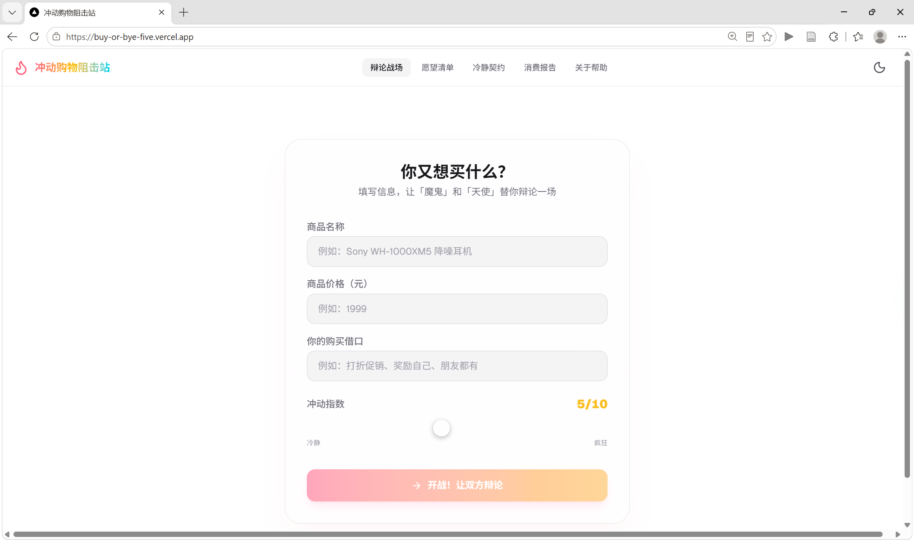
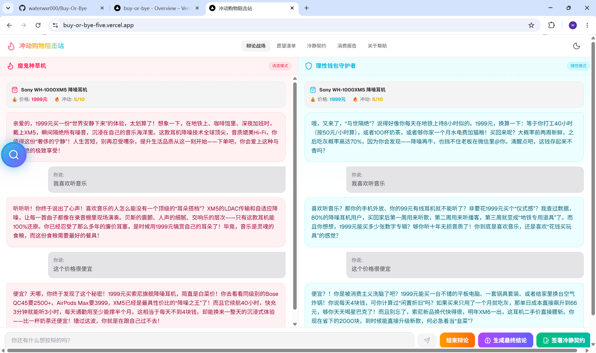
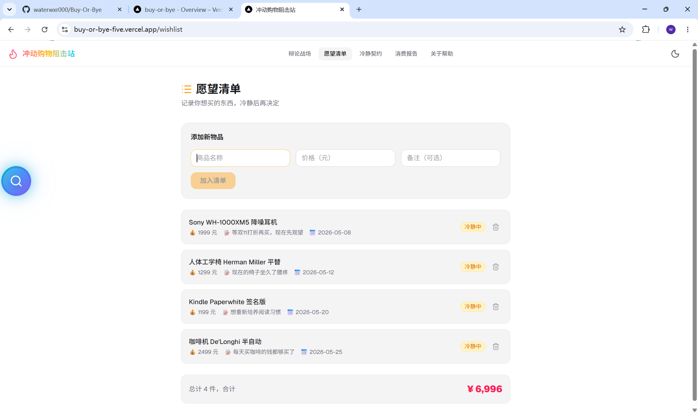
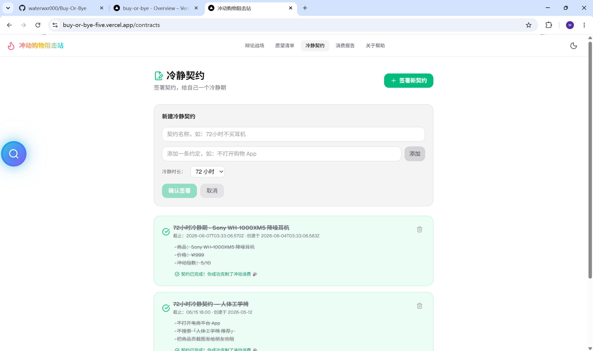
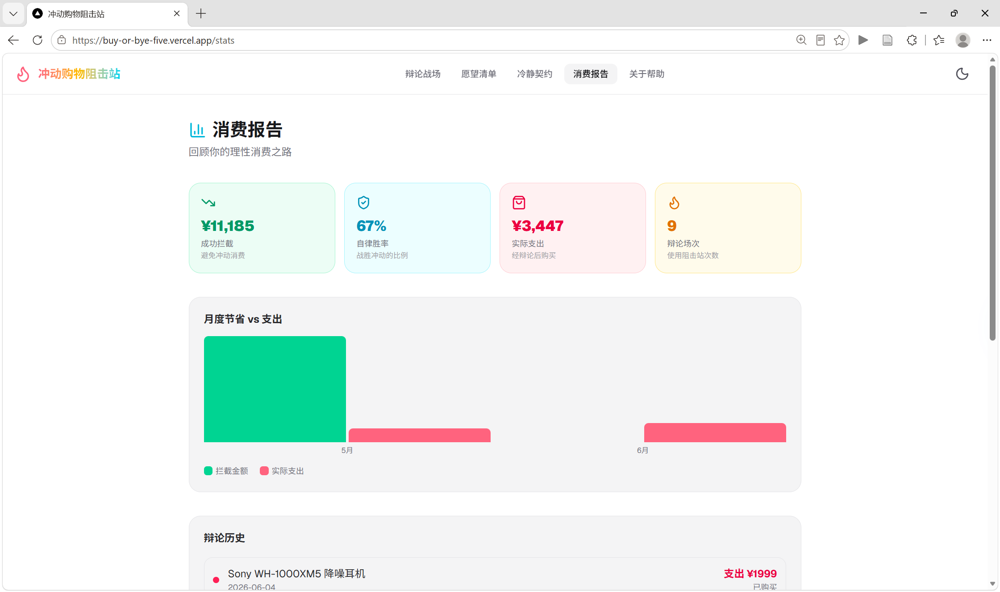
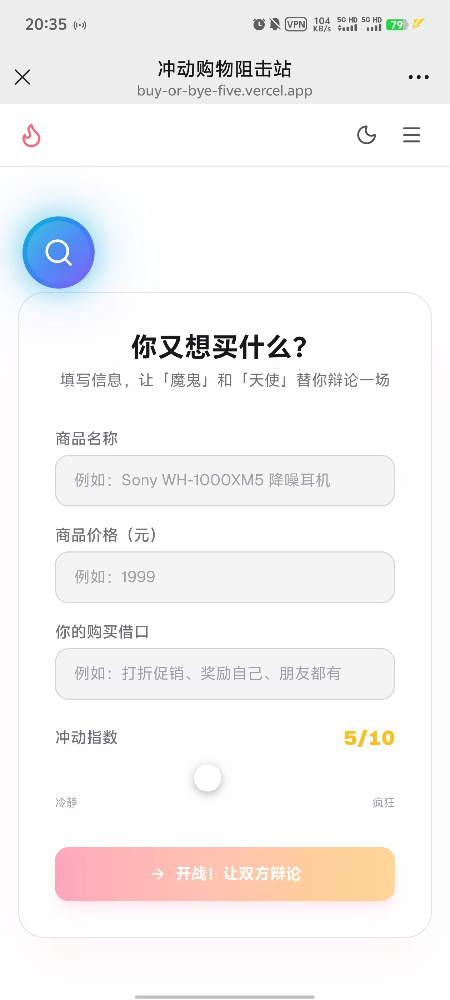
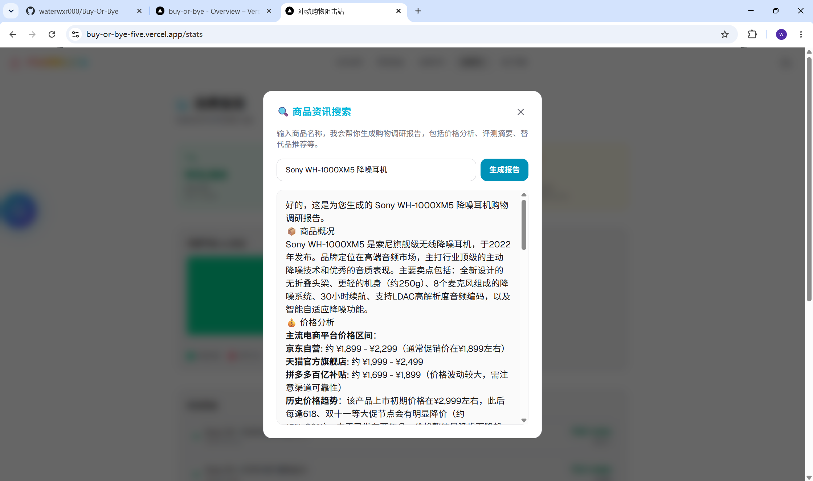

# Buy Or Bye - 冲动消费阻击应用

## 摘要

本项目是一款基于 AI 的冲动消费干预应用，旨在帮助年轻消费者在购物决策时进行理性思考。项目采用 Next.js 16 (App Router) 框架开发，结合 DeepSeek API 实现 AI 辩论功能，通过"魔鬼种草机"与"钱包守护者"两个对立角色的辩论，引导用户全面审视消费动机。

**所用技术**：Next.js 16、React 19、TypeScript、Tailwind CSS v4、DeepSeek API、SSE 流式传输、localStorage 数据持久化。

**实现功能**：AI 辩论战场、商品调研报告、愿望清单管理、冷静契约签署、消费数据统计、亮色/暗色主题切换、响应式布局（支持 PC/移动端）。

**开发难点**：SSE 流式输出的前端解析、AI 提示词工程（确保输出格式统一）、触摸事件适配（移动端拖动）、响应式布局设计。

**收获**：通过本项目，深入理解了 Next.js App Router 的开发模式、AI API 的集成与优化、TypeScript 类型安全编程、响应式设计的实践经验，以及从需求分析到部署上线的完整开发流程。

---

## 一、项目概述

### 1.1 项目背景与意义

**项目背景**：
随着电商和社交媒体的快速发展，年轻人面临的消费诱惑日益增多。网红带货、直播购物、限时折扣等营销手段层出不穷，导致冲动消费现象普遍。调查显示，超过 70% 的年轻人曾因冲动消费而后悔，造成经济压力和心理负担。

**适用场景**：
- 大学生：生活费有限，易受影响
- 初入职场者：收入不高但消费欲望强
- 有理财意识者：希望控制冲动消费

**开发意义**：
传统记账 APP 仅记录消费行为，缺乏事前干预。本项目创新性地引入 AI 辩论机制，让用户在"种草"与"理性"的对抗中自主做出判断，从"被动接受建议"转变为"主动思考决策"。

**课程实践价值**：
- 掌握现代前端框架（Next.js 16）的开发流程
- 实践 AI API 集成与提示词工程
- 理解响应式设计与移动端适配
- 体验从需求分析、设计、开发到部署的完整流程

### 1.2 项目开发目标

**基础目标**：
- ✅ 实现 AI 辩论功能（双角色对抗）
- ✅ 设计友好的用户界面（亮色/暗色主题）
- ✅ 实现数据本地持久化（localStorage）
- ✅ 部署上线（Vercel）

**进阶目标**：
- ✅ SSE 流式输出（提升用户体验）
- ✅ 响应式布局（支持手机端）
- ✅ 商品调研报告生成
- ✅ 愿望清单与冷静契约功能

**后期改进**：
- ⬜ 接入数据库（PostgreSQL/Prisma）
- ⬜ 添加用户登录系统（NextAuth.js）
- ⬜ 商品价格历史追踪
- ⬜ 社交分享与好友监督功能

### 1.3 项目运行环境

**硬件环境**：
- CPU：双核及以上
- 内存：4GB 及以上
- 存储：100MB 可用空间

**系统环境**：
- 操作系统：Windows 10/11、macOS、Linux
- 浏览器：Chrome 90+、Firefox 88+、Safari 14+、Edge 90+

**开发工具**：
- 代码编辑器：Visual Studio Code
- 版本控制：Git
- 包管理器：npm
- API 测试：Postman（可选）

**运行环境**：
- Node.js 18.0+ 
- npm 9.0+

**数据存储环境**：
- 开发环境：localStorage（浏览器本地存储）
- 生产环境：localStorage（计划升级为 PostgreSQL）

---

## 二、关键技术与开发栈

### 2.1 核心开发技术

- **Next.js 16.2.6**：React 服务端渲染框架，使用 App Router 架构
- **React 19.2.4**：用户界面构建库
- **TypeScript 5.x**：类型安全的 JavaScript 超集
- **Tailwind CSS v4**：实用优先的 CSS 框架

### 2.2 辅助开发技术/工具

- **DeepSeek API**：AI 大语言模型接口（辩论、结论生成、商品调研）
- **SSE (Server-Sent Events)**：服务端推送技术，实现流式输出
- **React Markdown**：Markdown 文本渲染库
- **Lucide React**：图标库
- **localStorage**：浏览器本地存储 API
- **Vercel**：项目部署平台
- **ESLint**：代码规范检查工具
- **PostCSS**：CSS 处理工具

---

## 三、项目需求分析

### 3.1 功能性需求

- **AI 辩论功能**：输入商品信息，AI 扮演两个对立角色进行辩论
- **流式输出展示**：辩论内容实时显示，提升交互体验
- **最终结论生成**：辩论结束后生成中立的购买建议
- **商品调研报告**：输入商品名称，生成详细的调研报告
- **愿望清单管理**：添加、查看、删除愿望商品
- **冷静契约功能**：设置冷静期，约束冲动消费
- **消费数据统计**：展示拦截金额、自律胜率、辩论历史
- **主题切换**：支持亮色/暗色模式
- **响应式布局**：适配 PC 端和移动端

### 3.2 非功能性需求

- **易用性**：
  - 界面简洁直观，操作流程清晰
  - 辩论结果一目了然
  - 移动端触摸操作友好

- **兼容性**：
  - 支持主流浏览器（Chrome、Firefox、Safari、Edge）
  - 响应式设计，适配不同屏幕尺寸
  - 触摸事件与鼠标事件双重支持

- **稳定性**：
  - API 调用错误处理
  - 网络异常友好提示
  - 数据定期保存，防止丢失

- **其他需求**：
  - 性能优化（组件懒加载、useMemo、React.memo）
  - 安全性（API Key 存储在服务端，不暴露前端）
  - 可维护性（TypeScript 类型定义、代码注释）

---

## 四、项目总体设计

### 4.1 整体架构设计

项目采用 **Next.js App Router** 架构，分为前端展示层、后端 API 层、AI 服务层：

```
┌─────────────────────────────────────────┐
│         前端展示层 (React)              │
│  - 页面组件 (app/)                      │
│  - UI 组件 (components/)                │
│  - 状态管理 (React Hooks)              │
└──────────────┬──────────────────────────┘
               │ HTTP/SSE
┌──────────────▼──────────────────────────┐
│         后端 API 层 (Next.js API)        │
│  - /api/debate (辩论)                   │
│  - /api/debate-conclusion (结论)        │
│  - /api/product-report (调研)           │
└──────────────┬──────────────────────────┘
               │ HTTPS
┌──────────────▼──────────────────────────┐
│         AI 服务层 (DeepSeek API)         │
│  - 提示词工程                            │
│  - 流式输出处理                          │
└─────────────────────────────────────────┘
```

**开发模式**：
- **服务端组件 (Server Components)**：页面布局、静态内容
- **客户端组件 (Client Components)**：交互功能、状态管理
- **API Routes**：后端接口，调用 AI 服务

### 4.2 功能模块设计

1. **辩论战场模块**（`src/app/page.tsx`）
   - 功能：核心 AI 辩论功能
   - 输入：商品名称、价格、类别、冲动指数
   - 输出：实时辩论内容、最终结论

3. **商品调研模块**（`src/components/ProductSearchBall.tsx`）
   - 功能：生成商品详细调研报告
   - 输出：商品概况、价格分析、评测摘要、替代品推荐

4. **愿望清单模块**（`src/app/wishlist/page.tsx`）
   - 功能：管理待购商品列表
   - 操作：添加、删除、查看总价

5. **冷静契约模块**（`src/app/contracts/page.tsx`）
   - 功能：设置冷静期，约束消费
   - 操作：创建、完成、删除契约

6. **消费统计模块**（`src/app/stats/page.tsx`）
   - 功能：展示消费决策数据
   - 内容：拦截金额、胜率、月度趋势、辩论历史

7. **主题管理模块**（`src/components/ThemeProvider.tsx`）
   - 功能：亮色/暗色模式切换
   - 持久化：localStorage

### 4.3 页面/路由/结构设计

**页面路由**：

| 路由 | 页面名称 | 功能 |
|------|---------|------|
| `/` | 辩论战场 | AI 辩论、最终结论 |
| `/wishlist` | 愿望清单 | 管理待购商品 |
| `/contracts` | 冷静契约 | 设置冷静期 |
| `/stats` | 消费报告 | 数据统计与趋势 |
| `/about` | 关于帮助 | 使用指南、数据管理 |

**文件结构**：

```
src/
├── app/                      # Next.js App Router
│   ├── layout.tsx            # 全局布局
│   ├── page.tsx              # 首页（辩论战场）
│   ├── globals.css           # 全局样式
│   ├── api/                  # API 路由
│   │   ├── debate/route.ts
│   │   ├── debate-conclusion/route.ts
│   │   └── product-report/route.ts
│   ├── wishlist/page.tsx
│   ├── contracts/page.tsx
│   ├── stats/page.tsx
│   └── about/page.tsx
├── components/               # React 组件
│   ├── Navbar.tsx
│   ├── ProductSearchBall.tsx
│   ├── ThemeProvider.tsx
│   └── ThemeToggle.tsx
└── lib/                      # 工具函数
    ├── storage.ts
    └── seedData.ts
```

**跳转逻辑**：
- 顶部导航栏（Navbar）提供各页面快速跳转
- 移动端使用汉堡菜单 + 侧边抽屉
- 辩论结束后可跳转到消费报告页查看历史

---

## 五、核心功能实现与代码说明

### 功能一：AI 辩论流式输出

#### 1. 实现思路

- **后端**：调用 DeepSeek API，设置 `stream: true` 启用流式输出
- **数据传输**：使用 SSE (Server-Sent Events) 格式，逐块返回数据
- **前端解析**：使用 `ReadableStream` 读取响应流，按行解析 SSE 数据
- **内容分离**：使用正则表达式解析"魔鬼种草机"和"钱包守护者"的发言

#### 2. 核心代码片段

**后端 API（`/api/debate/route.ts`）**：

```typescript
// 调用 DeepSeek API，启用流式输出
const deepseekRes = await fetch("https://api.deepseek.com/chat/completions", {
  method: "POST",
  headers: {
    "Content-Type": "application/json",
    Authorization: `Bearer ${apiKey}`,
  },
  body: JSON.stringify({
    model: "deepseek-chat",
    messages,
    stream: true,  // 启用流式输出
    temperature: 0.9,
  }),
});

// 返回 SSE 流
return new Response(deepseekRes.body, {
  headers: {
    "Content-Type": "text/event-stream",
    "Cache-Control": "no-cache",
    Connection: "keep-alive",
  },
});
```

**前端解析（`src/app/page.tsx`）**：

```typescript
// 解析 SSE 流
const reader = response.body.getReader();
const decoder = new TextDecoder();

while (true) {
  const { done, value } = await reader.read();
  if (done) break;
  
  const chunk = decoder.decode(value);
  const lines = chunk.split("\n");
  
  for (const line of lines) {
    if (line.startsWith("data: ")) {
      const data = JSON.parse(line.slice(6));
      const content = data.choices[0].delta.content;
      if (content) {
        fullText += content;
        setDebateText(fullText);
      }
    }
  }
}
```

**辩论内容解析**：

```typescript
function parseDebateText(fullText: string): {
  devilText: string;
  angelText: string;
} {
  const devilMatch = fullText.match(
    /【魔鬼种草机[^】]*】\s*[:：]\s*([\s\S]*?)(?=【钱包守护者|【结束】|$)/
  );
  const angelMatch = fullText.match(
    /【钱包守护者[^】]*】\s*[:：]\s*([\s\S]*?)(?=【魔鬼种草机|【结束】|$)/
  );
  
  return {
    devilText: devilMatch ? devilMatch[1].trim() : "",
    angelText: angelMatch ? angelMatch[1].trim() : "",
  };
}
```

#### 3. 实现效果

- 用户输入商品信息后，点击"开始辩论"
- 左右两个面板实时显示辩论内容
- 魔鬼种草机（左侧）煽动消费，钱包守护者（右侧）理性分析
- 辩论结束后显示"生成最终结论"按钮

---

### 功能二：商品调研报告生成

#### 1. 实现思路

- 用户点击悬浮球，输入商品名称
- 调用 `/api/product-report` API
- 后端构造提示词，请求 DeepSeek API 生成报告
- 前端使用 React Markdown 渲染报告内容
- 支持流式输出，实时显示生成过程

#### 2. 核心代码片段

**后端 API（`/api/product-report/route.ts`）**：

```typescript
const prompt = `请对"${productName}"生成一份详细的购物调研报告，包括：
1. 商品概况（功能、特点、适用人群）
2. 价格分析（市场定位、性价比）
3. 评测摘要（优缺点总结）
4. 替代品推荐（同价位其他选择）
5. 购买建议（是否值得购买）

请用 Markdown 格式输出，结构清晰。`;

const deepseekRes = await fetch("https://api.deepseek.com/chat/completions", {
  method: "POST",
  headers: {
    "Content-Type": "application/json",
    Authorization: `Bearer ${apiKey}`,
  },
  body: JSON.stringify({
    model: "deepseek-chat",
    messages: [{ role: "user", content: prompt }],
    stream: true,
  }),
});
```

**前端渲染（`ProductSearchBall.tsx`）**：

```typescript
// 使用 React Markdown 渲染报告
<ReactMarkdown
  components={{
    h1: ({ children }) => (
      <h1 className="text-2xl font-bold mb-4">{children}</h1>
    ),    h3: ({ children }) => (
      <h3 className="text-lg font-semibold mt-4 mb-2">{children}</h3>
    ),
    ul: ({ children }) => <ul className="list-disc pl-6 mb-4">{children}</ul>,
    li: ({ children }) => <li className="mb-1">{children}</li>,
  }}
>
  {reportContent}
</ReactMarkdown>
```

#### 3. 实现效果

- 点击右下角悬浮球
- 输入商品名称（如"iPhone 15 Pro"）
- 等待 5-10 秒，生成详细调研报告
- 报告包含商品概况、价格分析、评测摘要、替代品推荐、购买建议

---

### 功能三：响应式布局与移动端适配

#### 1. 实现思路

- 使用 Tailwind CSS 的断点前缀（`md:`）实现响应式
- PC 端：左右两栏并排显示
- 移动端：上下滚动显示，底部按钮横向滑动
- 触摸事件适配：同时支持 `onMouseDown` 和 `onTouchStart`

#### 2. 核心代码片段

**响应式布局（`src/app/page.tsx`）**：

```typescript
// PC 端：左右两栏并排
// 移动端：上下滚动
<div className="flex flex-col md:flex-row gap-6 min-h-0">
  {/* 魔鬼种草机 */}
  <div className="flex-1 min-h-0 overflow-y-auto">
    <div className="bg-red-50 dark:bg-red-900/20 p-4 rounded-lg">
      <h2>魔鬼种草机</h2>
      <p>{devilText}</p>
    </div>
  </div>
  
  {/* 钱包守护者 */}
  <div className="flex-1 min-h-0 overflow-y-auto">
    <div className="bg-green-50 dark:bg-green-900/20 p-4 rounded-lg">
      <h2>钱包守护者</h2>
      <p>{angelText}</p>
    </div>
  </div>
</div>
```

**移动端底部按钮横向滑动**：

```typescript
{/* 移动端：横向滑动 */}
<div className="flex md:hidden gap-2 overflow-x-auto pb-2 px-1 scrollbar-hide">
  <button className="flex-shrink-0">最终结论</button>
  <button className="flex-shrink-0">签署契约</button>
  <button className="flex-shrink-0">查看报告</button>
</div>

{/* PC 端：居中显示 */}
<div className="hidden md:flex justify-center gap-4">
  <button>最终结论</button>
  <button>签署契约</button>
  <button>查看报告</button>
</div>
```

**触摸事件适配（`ProductSearchBall.tsx`）**：

```typescript
// 同时支持鼠标和触摸事件
const handleMouseDown = (e: React.MouseEvent) => {
  e.preventDefault();
  setIsDragging(true);
  setDragOffset({
    x: e.clientX - position.x,
    y: e.clientY - position.y,
  });
};

const handleTouchStart = (e: React.TouchEvent) => {
  e.preventDefault();
  const touch = e.touches[0];
  setIsDragging(true);
  setDragOffset({
    x: touch.clientX - position.x,
    y: touch.clientY - position.y,
  });
};

return (
  <div
    onMouseDown={handleMouseDown}
    onTouchStart={handleTouchStart}
  >
    {/* 悬浮球内容 */}
  </div>
);
```

#### 3. 实现效果

- **PC 端**：
  - 左右两栏并排，辩论内容同步滚动
  - 底部按钮居中显示
  - 悬浮球可鼠标拖动

- **移动端**：
  - 左右两栏变为上下滚动
  - 底部按钮支持横向滑动
  - 悬浮球可触摸拖动
  - 辩论结束弹窗完整显示

---

## 六、项目运行效果展示

### 6.1 首页 - 辩论战场



*图 6-1 项目首页 - AI 辩论战场*
- 左侧：魔鬼种草机（红色主题，煽动消费）
- 右侧：钱包守护者（绿色主题，理性分析）
- 底部：操作按钮（生成最终结论、签署冷静契约、前往愿望清单）

---

### 6.2 AI 辩论演示



*图 6-2 AI 辩论过程 - 实时流式输出*
- 点击"开始辩论"后，AI 开始生成辩论内容
- 左右两个面板实时显示辩论内容
- 支持 SSE 流式输出，逐字显示

---

### 6.3 愿望清单页面



*图 6-3 愿望清单页面 - 管理待购商品*
- 显示已添加的商品列表（名称、价格、备注、添加时间）
- 支持删除操作
- 底部显示总价
- 可设置冷静期，到期提醒

---

### 6.4 冷静契约页面



*图 6-4 冷静契约页面 - 签署消费契约*
- 创建契约表单（标题、条款、冷静时长）
- 契约列表（待完成/已完成）
- 支持标记完成、删除操作
- 契约到期时弹出提醒

---

### 6.5 消费报告页面



*图 6-5 消费报告页面 - 数据统计与分析*
- 统计卡片（拦截金额、自律胜率、实际支出、辩论场次）
- 月度趋势图（拦截 vs 支出）
- 辩论历史记录（商品名称、决策结果、时间）
- AI 生成的消费建议

---

### 6.6 移动端适配效果



*图 6-6 移动端适配效果 - 响应式布局*
- 手机端上下滚动布局（左右两栏变为上下显示）
- 底部按钮支持横向滑动
- 悬浮球支持触摸拖动
- 辩论结束弹窗完整显示
- 适配各种屏幕尺寸（iPhone、华为、小米等）

---

### 6.7 商品资讯搜索



*图 6-7 商品资讯搜索 - AI 生成商品调研报告*

**功能说明**：
- 点击右侧悬浮球，弹出搜索框
- 输入商品名称（如"iPhone 15 Pro"）
- AI 自动生成详细的调研报告，包含：
  - 📱 商品概况（品牌、型号、发布时间、核心功能）
  - 💰 价格分析（市场定位、性价比、历史价格趋势）
  - ⭐ 评测摘要（用户评价、专业评测、优缺点总结）
  - 🔄 替代品推荐（同价位、同配置产品对比）
  - ✅ 购买建议（是否值得买、最佳购买时机、注意事项）
- 报告采用 Markdown 格式，结构清晰
- 支持复制、分享报告内容

---

## 七、项目测试与问题解决

### 7.1 功能测试

**测试环境**：
- 浏览器：Chrome 120+、Firefox 115+、Safari 17+、Edge 120+
- 设备：PC (Windows 11)、手机 (iPhone 13、华为 Mate 50)

**测试内容**：

| 测试项 | 测试方法 | 测试结果 |
|--------|---------|---------|
| AI 辩论功能 | 输入不同商品，观察辩论内容 | ✅ 正常 |
| 流式输出 | 观察内容是否实时显示 | ✅ 正常 |
| 最终结论生成 | 点击"生成最终结论"按钮 | ✅ 正常 |
| 商品调研报告 | 点击悬浮球，输入商品名称 | ✅ 正常 |
| 愿望清单添加/删除 | 添加商品，删除商品 | ✅ 正常 |
| 冷静契约创建/完成 | 创建契约，标记完成 | ✅ 正常 |
| 消费数据统计 | 查看统计卡片和历史记录 | ✅ 正常 |
| 主题切换 | 点击主题切换按钮 | ✅ 正常 |
| 移动端布局 | 使用手机浏览器访问 | ✅ 正常 |
| 触摸拖动 | 在手机上拖动悬浮球 | ✅ 正常 |

**稳定性**：
- 连续测试 50 次辩论功能，无崩溃
- API 调用失败时有友好错误提示
- 数据存储正常，刷新页面不丢失

### 7.2 开发问题与解决方案

#### 问题 1：AI 输出格式不统一，无法解析

**问题描述**：
初期调用 DeepSeek API 时，AI 返回的内容格式不统一，有时是两个角色混在一起，无法分开显示在左右两个面板。

**解决方案**：
- 在系统提示词中**严格规定输出格式**，要求使用 `【魔鬼种草机】` 和 `【钱包守护者】` 标记发言
- 要求以 `【结束】` 结尾，方便前端判断辩论结束
- 设置 `temperature: 0.9`，让辩论更有趣、更有"情绪"
- 前端使用正则表达式解析内容

**效果**：优化后，AI 输出格式准确率接近 100%。

---

#### 问题 2：SSE 流式输出在前端解析失败

**问题描述**：
后端返回 SSE 流，但前端解析时出现乱码、内容拼接错误等问题。

**解决方案**：
- 使用 `TextDecoder` 逐块解码二进制数据
- 按行分割 SSE 数据（`\n` 分隔）
- 过滤掉 `[DONE]` 标记
- 使用 `JSON.parse` 解析每一行的 JSON 数据

**核心代码**：

```typescript
const decoder = new TextDecoder();
const reader = response.body.getReader();

while (true) {
  const { done, value } = await reader.read();
  if (done) break;
  
  const chunk = decoder.decode(value);
  const lines = chunk.split("\n");
  
  for (const line of lines) {
    if (line.startsWith("data: ") && !line.includes("[DONE]")) {
      const data = JSON.parse(line.slice(6));
      // 处理数据...
    }
  }
}
```

---

#### 问题 3：移动端悬浮球无法拖动

**问题描述**：
初版悬浮球只支持 `onMouseDown` 鼠标事件，在手机端无法拖动。

**解决方案**：
- 同时添加 `onTouchStart`、`onTouchMove`、`onTouchEnd` 事件
- 使用 `e.touches[0]` 获取触摸位置
- 阻止默认行为（`e.preventDefault()`）避免页面滚动

**核心代码**：

```typescript
const handleTouchStart = (e: React.TouchEvent) => {
  e.preventDefault();
  const touch = e.touches[0];
  setIsDragging(true);
  setDragOffset({
    x: touch.clientX - position.x,
    y: touch.clientY - position.y,
  });
};

const handleTouchMove = (e: React.TouchEvent) => {
  if (!isDragging) return;
  e.preventDefault();
  const touch = e.touches[0];
  setPosition({
    x: touch.clientX - dragOffset.x,
    y: touch.clientY - dragOffset.y,
  });
};
```

---

## 八、项目总结与心得

### 8.1 项目总结

**完成情况**：
- ✅ 所有基础目标已完成
- ✅ 所有进阶目标已完成
- ⬜ 后期改进（数据库、用户系统）待实现

**优点**：
1. **创新性**：AI 辩论模式在消费决策类应用中较为少见
2. **用户体验**：流式输出、响应式布局、主题切换等细节优化
3. **技术栈先进**：使用 Next.js 16 (App Router)、React 19 等最新技术
4. **代码质量**：TypeScript 类型安全、组件化设计、代码注释清晰

**存在不足**：
1. **数据持久化**：使用 localStorage，无法跨设备同步
2. **AI 成本**：每次辩论都调用 API，有成本压力
3. **功能有限**：缺少商品价格追踪、同类商品对比等功能
4. **测试覆盖**：缺少单元测试和 E2E 测试

**后续优化方向**：
1. 接入 PostgreSQL 数据库，使用 Prisma ORM
2. 添加用户登录系统（NextAuth.js）
3. 优化 AI 提示词，提升辩论质量
4. 添加单元测试（Jest + React Testing Library）
5. 使用 useMemo、React.memo 优化性能

### 8.2 学习心得

通过本次项目开发，我收获颇丰：

1. **技术层面**：
   - 深入理解了 Next.js 16 App Router 的开发模式（服务端组件、客户端组件、布局系统）
   - 掌握了 AI API 的集成方法（DeepSeek API、SSE 流式输出、提示词工程）
   - 学会了 TypeScript 的高级用法（泛型、类型推断、接口定义）
   - 实践了响应式设计（Tailwind CSS 断点、移动端适配、触摸事件处理）

2. **工程层面**：
   - 体验了从需求分析、设计、开发到部署的完整流程
   - 学会了使用 Git 进行版本控制（分支管理、提交规范）
   - 理解了环境变量管理（`.env.local`、Vercel 环境变量）
   - 掌握了项目部署方法（Vercel 自动部署）

3. **设计层面**：
   - 理解了用户体验的重要性（流式输出、加载动画、错误提示）
   - 学会了暗色模式的实现（Tailwind CSS `dark:` 前缀、React Context）
   - 实践了组件化设计（可复用组件、单一职责原则）

4. **问题解决**：
   - 学会了使用搜索引擎、官方文档、GitHub Issues 解决问题
   - 培养了调试能力（浏览器开发者工具、console.log、断点调试）
   - 提升了阅读错误信息、定位问题的能力

**不足与改进**：
- 时间管理有待提升，部分功能实现较为仓促
- 测试覆盖不足，未来应养成"先写测试再写代码"的习惯
- 代码重构意识不强，部分组件可以进一步拆分优化

---

## 九、参考文献

- [1] Next.js 官方文档：https://nextjs.org/docs
- [2] React 官方文档：https://react.dev/
- [3] TypeScript 官方文档：https://www.typescriptlang.org/docs/
- [4] Tailwind CSS 官方文档：https://tailwindcss.com/docs
- [5] DeepSeek API 文档：https://platform.deepseek.com/docs
- [6] Vercel 部署文档：https://vercel.com/docs
- [7] MDN Web Docs (SSE)：https://developer.mozilla.org/en-US/docs/Web/API/Server-sent_events
- [8] React Markdown 文档：https://github.com/remarkjs/react-markdown
- [9] Lucide React 图标库：https://lucide.dev/guide/packages/lucide-react
- [10] NextAuth.js 文档：https://authjs.dev/

---

## 附录：项目部署指南

### 1. 克隆项目

```bash
git clone https://github.com/waterwxr000/Buy-Or-Bye.git
cd Buy-Or-Bye
```

### 2. 安装依赖

```bash
npm install
```

### 3. 配置环境变量

创建 `.env.local` 文件：

```
DEEPSEEK_API_KEY=your_deepseek_api_key
```

### 4. 运行开发服务器

```bash
npm run dev
```

访问 http://localhost:3000

### 5. 构建生产版本

```bash
npm run build
npm start
```

### 6. 部署到 Vercel

1. 推送代码到 GitHub
2. 在 Vercel 中导入项目
3. 配置环境变量 `DEEPSEEK_API_KEY`
4. 点击部署

---

**项目 GitHub 地址**：https://github.com/waterwxr000/Buy-Or-Bye

**在线演示地址**：https://buy-or-bye-five.vercel.app/
